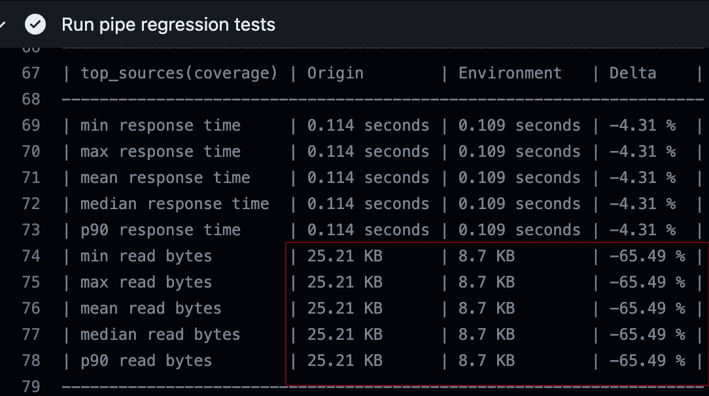

# Change a Data Source Sorting Key

DISCLAIMER: This document is a draft and subject to change.

Link to all the PRs for this example: [CSK PRs](https://github.com/tinybirdco/use-case-examples/pulls?q=is%3Apr+is%3Aclosed+CSK)

Altering a sorting key is a complex operation involving multiple steps and requires data migration.

> Remember to follow the [instructions](../README.md) to setup your Tinybird Data Project before jumping into the use-case steps

## Step 1: Downstream Replication and Sync Preparation
This step involves cloning the Data Source whose sorting key we want to alter, along with all dependent Materialized Views, to create a new Downstream branch. This is where you will transition all relevant data to utilize the new Sorting Key.

- Establish a new branch
- Replicate your Data Source with the updated sorting key:
  - `analytics_events.datasource` -> `analytics_events_new (using the new sorting key)`
- Replicate all dependent resources. These include your Data Source and all Materialized Views and Pipes that link them. Do not clone or modify Pipe Endpoints at this time.
  - `analytics_events.datasource` -> `analytics_events_new` (with the new sorting key)
  - `analytics_pages_mv.datasource` -> `analytics_pages_mv_new.datasource`
  - `analytics_sessions_mv.datasource` -> `analytics_session_mv_new.datasource`
  - `analytics_sources_mv.datasource` -> `analytics_sources_mv_new.datasource`
  - `analytics_sessions.pipe` -> `analytics_sessions_new.pipe` (alter to materialize on `analytics_sessions_mv_new.datasource`)
  - `analytics_pages.pipe` -> `analytics_pages_new.pipe` (alter to materialize on `analytics_pages_mv_new.datasource`)
  - `analytics_sources.pipe` -> `analytics_sources_new.pipe` (alter to materialize on `analytics_sources_mv_new.datasource`)
  - `analytics_hits.pipe` -> `analytics_hits_new.pipe` (alter to query  `analytics_events_new.datasource`)
- Create a Materialized Pipe (`new_data_sync.pipe`) to synchronize incoming data from the legacy Data Source to the new one. Implement a filter to sync data only beyond a specific future point. This sets the stage for the subsequent step.
- Push the changes to the branch and initiate a Pull Request. The Continuous Integration (CI) process will validate the changes through Regression, Quality, and Fixture tests ([learn more about testing](https://www.tinybird.co/docs/guides/implementing-test-strategies.html)). 
- Before merging, verify your adjustments in the temporary environment that is provisioned.
- Merge the PR to trigger the Continuous Deployment (CD) workflow, and your changes will be propagated to the Main environment.

View the pull request with all changes for this step: [PR Downstream replication](https://github.com/tinybirdco/use-case-examples/pull/22/files)

## Step 2: Backfilling
- Update your Main code branch and initiate a fresh branch.
- Await the pre-set time in the `new_data_sync.pipe` before proceeding with changes.
- Add a backfilling pipe [`backfilling.pipe`]() to populate old data to your new Data Source and, thereby updating all the downstream.

- Generate a new CI/CD version `tb release generate --semver 0.0.1`
- Modify the CI file:
    - Execute a custom deployment script ensuring fixtures are included for testing and the `backfilling.pipe` populates the new Data Source: tb `deploy --populate --fixtures --wait`

- Modify the CD file:
    - Similar to CI but exluding fixture appending:  `tb deploy --populate --wait`

- Additionally, incorporate a Quality Test to confirm that the row counts in the new and legacy Data Sources align:
  ```sql
    WITH
        curr AS (
            SELECT count() AS cnt
            FROM analytics_events
            WHERE timestamp <= NOW() - INTERVAL '10 second'
        ),
        new AS (
            SELECT count() AS cnt
            FROM analytics_events_new
            WHERE timestamp <= NOW() - INTERVAL '10 second'
        )
    SELECT curr.cnt - new.cnt AS diff
    FROM curr, new
    WHERE diff != 0
  ```
  
- Push your branch, create a PR, and merge after all tests succeed. As always, inspect your temporary environment for the PR to ensure all is in order before advancing to production.

View the pull request with all changes for this step: [PR Backfilling](https://github.com/tinybirdco/use-case-examples/pull/23/files) 

## Step 3: Endpoint Modification to Utilize New Materialized Views
- After merging the previous branch, update your Main branch, and create a new one.
- Modify SQL code within endpoints to reference the newly created resources.
- Increment the version in the tinyenv file to bypass the prior version's custom deployment.
- Create a new Pull Request with the changes. It's interesting to check the improvements made by the new Sorting Key. While the `response time` metrics are not relevant due to the small amount of rows, the `read bytes` metrics can give us a good idea of how the peformance of the queries will change.
  
- Merge the Pull Request and waits until the deployment ends successfully. 

View the pull request with all changes for this step: [PR Update Environments](https://github.com/tinybirdco/use-case-examples/pull/25/files) 

## Step 4: Switch to the New Data Source and cleanup
Now you can start using the new Data Source. Once everything that produces data is pointing to the new Data Source, you can get rid of the old resources and the temporary pipes we set up for moving the data.

We'll keep these in the repository to show how it was done.


[Internal workspace](https://ui.tinybird.co/ca5e810a-3add-44a9-a6fd-bae47a13256b/dashboard)