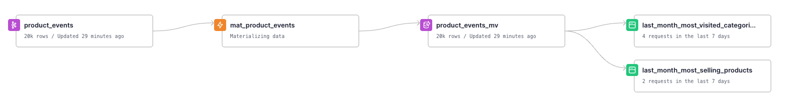

# Tinybird Versions - Change Sorting Key to Kafka connected Data Source

The solution consists of creating a Materialized View with the desired Sorting Key, between the Kafka Landing Data Source and its endpoints.

[Pull Request](https://github.com/tinybirdco/use-case-examples/pull/195/files)

## Initial status

We have two endpoints connected to a Kafka Data Source. We want to change the Sorting Key to the Data Source.


## Create a Materialized View with the desired Sorting Key and change the Endpoint pipes

- Create the Materialized View ([Pipe](./pipes/mat_product_events.pipe) and [Data Source](./datasources/product_events_mv.datasource)) with the new desired Sorting Key.

- Change your endpoints to make use of the new Materialized View:

`last_month_most_selling_products.pipe`:
```diff
@@ -7,10 +7,10 @@ 
SQL >
    SELECT
         product_id, 
         COUNT(*) AS c,
         toMonth(now() - INTERVAL 1 MONTH) as month
-    FROM product_events
+    FROM product_events_mv
     WHERE 
         event_name = 'buy-product' AND 
-        __timestamp >= toStartOfMonth(now()) - INTERVAL 1 MONTH
+        timestamp >= toStartOfMonth(now()) - INTERVAL 1 MONTH
     GROUP BY 
         product_id
     ORDER BY
         c DESC
```

`last_month_most_visited_categories.pipe`:
```diff
@@ -7,10 +7,10 @@ 
SQL >
    SELECT
         product_type, 
         COUNT(*) AS c,
         toMonth(now() - INTERVAL 1 MONTH) as month
-    FROM product_events
+    FROM product_events_mv
     WHERE 
         event_name = 'page-load' AND 
-        __timestamp >= toStartOfMonth(now()) - INTERVAL 1 MONTH
+        timestamp >= toStartOfMonth(now()) - INTERVAL 1 MONTH
     GROUP BY 
         product_type
     ORDER BY
         c DESC
```

## Deployment

- Bump the major version in the `.tinyenv`:

```diff
- 0.0.0
+ 1.0.0
```

Bumping the major the deployment will create a `Preview Release` with the modifications. The recently created Materialized View `product_events_mv` will start to receive production data since it's created in the `Preview release`. 

> Previews are very convenient to check our changes after deploying them to `live`. But also required if we want to backfill the the Materialized View with the `live` data previous to their creation.

- Push the changes to a branch and initiate a Pull Request. If it's your case, the Continuous Integration (CI) process will validate the changes through Regression, Quality, and Fixture tests ([learn more about testing](https://www.tinybird.co/docs/guides/implementing-test-strategies.html)).
  
- Before merging, verify your adjustments in the temporary Tinybird Branch that is provisioned.
  
- Merge the PR to trigger the Continuous Deployment (CD) workflow will deploy your changes in a Preview Release.

## Backfill

- At this moment you can decide if you want to backfill the old data. If it's the case, you can create a new PR with a custom deployment and execute:
  
  ```bash
  tb --semver 1.0.0 pipe populate mat_product_events --node product_events_0 --sql-condition "timestamp < $BACKFILL_DATE" --wait
  ```
  
  where `$BACKFILL_DATE` is your earliest row timestamp in the recently created Materialized View `product_events_mv` in the `Preview Release`.


## Promote from Preview to Live

- Once you're happy with your Preview Release you can promote it to `live` following one of the next options:

    - The action `Tinybird - Releases Workflow` in the case you are using our workflow templates.
    - Promote from the UI.
    - Or CLI:

        ```sh
        tb release promote --semver 1.0.0
        ```



