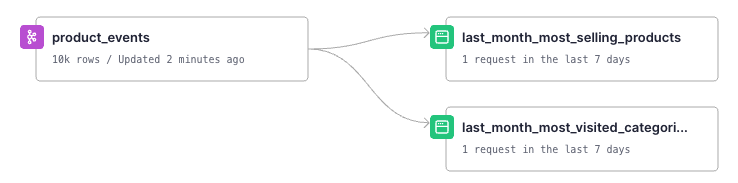
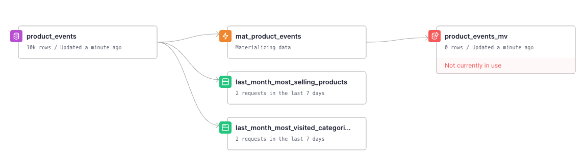
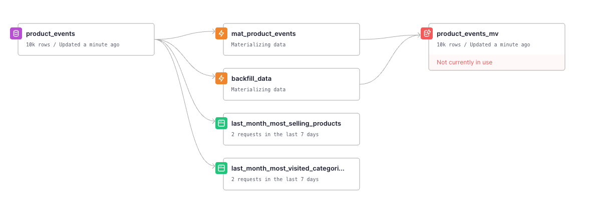
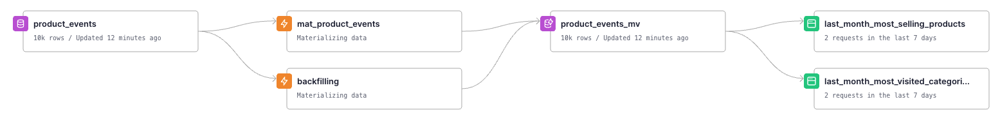

# Change Sorting Key in a Kafka connected Data Source

The solution is to create a Materialized View with the desired Sorting Key, between the Kafka Landing Data Source and its endpoints.

## Initial status

We have two endpoints connected to a Kafka Data Source. We want to change the Sorting Key to the Data Source.



[#Project initialization PR](https://github.com/tinybirdco/use-case-examples/pull/103)

## Step 1 - Create the Materialized View with the desired Sorting Key

- Push the changes to the branch and initiate a Pull Request. The Continuous Integration (CI) process will validate the changes through Regression, Quality, and Fixture tests ([learn more about testing](https://www.tinybird.co/docs/guides/implementing-test-strategies.html)). 
- Before merging, verify your adjustments in the temporary environment that is provisioned.
- Merge the PR to trigger the Continuous Deployment (CD) workflow, and your changes will be propagated to the Main environment.



[#New MV PR](https://github.com/tinybirdco/use-case-examples/pull/104)

## Step 2: Backfilling

- Update your Main code branch and initiate a fresh branch.
- Await the pre-set time in the `mat_product_events.pipe` before proceeding with changes.
- Add a backfilling pipe [`backfilling.pipe`]() to populate old data to your new Data Source.
- Generate a new CI/CD version `tb release generate --semver 0.0.1`
- Modify the CI file:
    - Execute a custom deployment script ensuring fixtures are included for testing and the `backfilling.pipe` populates the new Data Source: tb `deploy --populate --fixtures --wait`

- Modify the CD file:
    - Similar to CI but exluding fixture appending:  `tb deploy --populate --wait`

- Additionally, incorporate a Quality Test to confirm that the row counts in the new and legacy Data Sources align:
  
  ```sql
    WITH
        curr AS (
            SELECT count() AS cnt
            FROM product_events
            WHERE __timestamp <= NOW() - INTERVAL '10 second'
        ),
        new AS (
            SELECT count() AS cnt
            FROM product_events_mv
            WHERE timestamp <= NOW() - INTERVAL '10 second'
        )
    SELECT curr.cnt - new.cnt AS diff
    FROM curr, new
    WHERE diff != 0
  ```




[#Backfilling PR](https://github.com/tinybirdco/use-case-examples/pull/108)

# Step 3 - Move the endpoints to the new Materialized View

It's the momment to change the endpoints to point to the new Materialized View instead of the Landing Kafka Data Source.

```diff
index c15a30f..7fa848c 100644
--- a/change_sorting_key_to_kafka_data_source/pipes/last_month_most_selling_products.pipe
+++ b/change_sorting_key_to_kafka_data_source/pipes/last_month_most_selling_products.pipe
@@ -7,10 +7,10 @@ SQL >
         product_id, 
         COUNT(*) AS c,
         toMonth(now() - INTERVAL 1 MONTH) as month
-    FROM product_events
+    FROM product_events_mv
     WHERE 
         event_name = 'buy-product' AND 
-        __timestamp >= toStartOfMonth(now()) - INTERVAL 1 MONTH
+        timestamp >= toStartOfMonth(now()) - INTERVAL 1 MONTH
     GROUP BY 
         product_id
     ORDER BY 
```

```diff --git a/change_sorting_key_to_kafka_data_source/pipes/last_month_most_visited_categories.pipe b/change_sorting_key_to_kafka_data_source/pipes/last_month_most_visited_categories.pipe
index c49d0e3..a9071af 100644
--- a/change_sorting_key_to_kafka_data_source/pipes/last_month_most_visited_categories.pipe
+++ b/change_sorting_key_to_kafka_data_source/pipes/last_month_most_visited_categories.pipe
@@ -7,10 +7,10 @@ SQL >
         product_type, 
         COUNT(*) AS c,
         toMonth(now() - INTERVAL 1 MONTH) as month
-    FROM product_events
+    FROM product_events_mv
     WHERE 
         event_name = 'page-load' AND 
-        __timestamp >= toStartOfMonth(now()) - INTERVAL 1 MONTH
+        timestamp >= toStartOfMonth(now()) - INTERVAL 1 MONTH
     GROUP BY 
         product_type
     ORDER BY 
```



[#Endpoints PR](https://github.com/tinybirdco/use-case-examples/pull/106)

> We keep the `backfilling.pipe` for demo purposes but at this point it is safe to remove it
