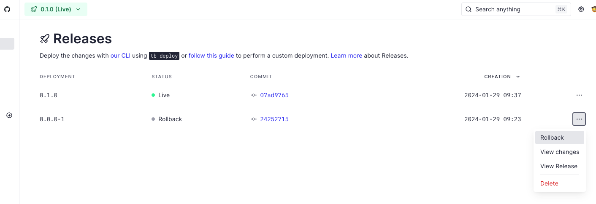
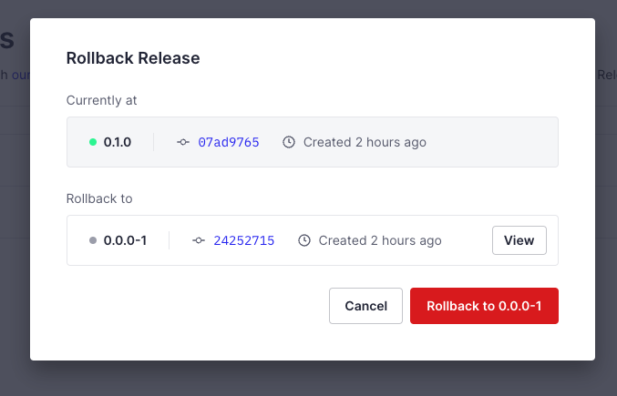

# How to Rollback changes

In this example we're rolling back a Workspace from a Release with version **0.1.0** to the previous version **0.0.0-1**. The Rollback involves removing an unwanted Endpoint introduced in **0.1.0**. We also explain how to ensure synchronization between the Workspace *live* version and the Git repository when a Rollback operations is run.

[Pull Request of this example](https://github.com/tinybirdco/use-case-examples/pull/229/files)

## First Step

1. Navigate to the UI's Release list.

2. Identify Release in Rollback status we want to set as **Live** Release again (**0.0.0-1**).

3. Click the Rollback action button for this Release.



4. A confirmation modal will appear. Verify the current version and the target version for rollback.



5. Note the current Release commit number containing the changes to be reverted, in our case *07ad9765*.


## Second Step:

1. Locate the commit/pull request for the changes to be reverted, for this example the commit is *07ad9765* and contains all the changes we want to revert.


2. Create a new Git branch and execute the following command:
   
```bash
git revert -m 1 07ad9765
```

3. Verify the desired changes have been successfully reverted in this Git branch.

4. Update the SemVer file version from **0.0.0-1** to **0.0.0-2**. We're not introducing new changes but we need to bump the version, in other case the CI checks will fail. In addition is useful to know track the Rollback operation.

> Important! Increment the post-release segment (-1 in **0.0.0-1**) or add -1 if not present, of the Release being reverted to, don't take by error the version of the unwanted Release.

5. Commit these changes and create a pull request (PR). Wait for all checks to pass before merging.
   
6. Once merged, the UI will display **0.0.0-2** as the current Release version, identical to **0.0.0-1**, but confirming that both code and Workspace are synchronized.
