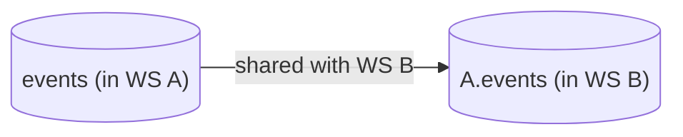

# Tinybird Versions - Use a new column coming from a Shared Data Source

Sharing Data Sources among multiple workspaces is a common practice. One typical scenario involves having a workspace that houses all landing Data Sources, centralizing all ingestion operations, and then sharing them with specific workspaces.



Throughout the lifecycle of a Data Project, it's likely that the landing Data Source schema changes, with new columns being added. In such cases, it becomes necessary to reflect those changes in the Workspaces utilizing the shared Data Source.

This guide will demonstrate how to add new columns from a shared data source to your workspace.

> Remember to follow the [instructions](../README.md) to setup your Tinybird Data Project before jumping into the use-case steps

Step 1: Obtain the new schema from the landing Data Source

[Step 1 PR](https://github.com/tinybirdco/use-case-examples/pull/66/commits/c494a7e35353cceb9e23926a7c473485c12b3acc)

The shared Data Source of a Workspace resides in the `vendor` folder, following the naming pattern `vendor\{ORIGINAL_WORKSPACE}\{DATASOURCE NAME}`.

First of all, create a new Git branch so that all changes can be added to a Pull Request.

```sh
git checkout -b add_new_project_column
```

To use the new columns added in the original Workspace, you need to update the schema by pulling the latest changes.

```sh
tb pull --match analytics_events --force
```

Two important points:

- We use `--match analytics_events` to select the specific Data Source we want to update.
- We use `--force` to actually get the changes. As the Data Source is already in the Workspace, `tb pull` would ignore the file. Using the option `--force` instructs the CLI to overwrite the file with its latest state.

The result is that the schema from the shared Data Source now reflects the new columns present in its original Workspace.

```diff
...
    `session_id` String,
    `action` LowCardinality(String),
    `version` LowCardinality(String),
    `payload` String,
+   `project` String

ENGINE "MergeTree"
ENGINE_PARTITION_KEY "toYYYYMM(timestamp)"
...
```

That's all you need to do to get the latest schema in your Workspace. Since the Data Source is shared, the more complex iteration to bring in the new columns is done in its original workspace. We only need to get the latest schema.

## Step 2: Update the resources that use the shared Data Source

[Step 2 PR](https://github.com/tinybirdco/use-case-examples/pull/66/commits/8ae35b42ab8d162de3c29e4131b88f1135323dc3)

Once you have the latest schema, iterate through the resources that need the newest columns. For brevity, we'll illustrate iterating one endpoint.

In this example, we use the new column `project`` to add a new filter based on a query parameter.

```diff
NODE node_0

SQL >
+   %
    SELECT count() as hits
    FROM versions_analytics_use_case.analytics_events
    WHERE action = 'page_hit'
    AND timestamp >= now() - interval 1 hour
+   
+       AND project = {{String(project)}}
+   
```

Now, commit these changes, create a PR, and once the CI pipeline of the created PR validates your changes, you can merge it to deploy in the main environment.
