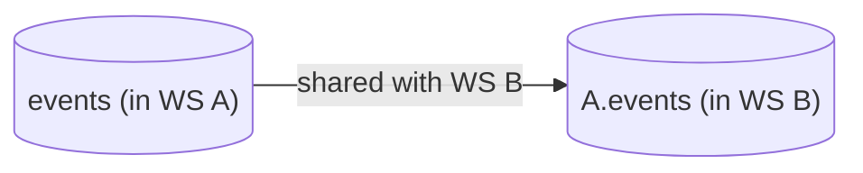

# Tinybird Versions - Use a new column coming from a Shared Data Source

Sharing Data Sources among several workspaces is a common scenario. One of the usual scenarios is having a workspace with all landing Data Sources, centralizing all ingestion operations, and then share them with particular Workspaces.



During the life of a Data Project, it's likely that the landing Data Source schema changes, ingesting new columns and adding them to the schema. Then, you need to reflect those changes in the Workspaces that use this shared Data Source.

In this guide we'll show you how to do add the new columns from a Shared Data Source to your Workspace.

> Remember to follow the [instructions](../README.md) to setup your Tinybird Data Project before jumping into the use-case steps

## Step 1: Get the new schema from the landing Data Source

[Step 1 PR](https://github.com/tinybirdco/use-case-examples/pull/66/commits/c494a7e35353cceb9e23926a7c473485c12b3acc)

The Shared Data Source of a Workspace reside in the `vendor` folder. They follow the naming pattern `vendor\{ORIGINAL_WORKSPACE}\{DATASOURCE NAME}`

First of all, create a new Git branch, so all changes can be added to a Pull Request.

`sh`
git checkout -b add_new_project_column

````

In order to use the new columns that were added in the original Workspace, you need to update the schema. You just need to pull the latest changes.

```sh
tb pull --match analytics_events --force
````

Two remarks:

- We use `--match analytics_events` to select the particular Data Source we want to update.
- We use `--force` to actually get the changes. As the Data Source is already in the Workspace, `tb pull` would ignore the file. By using the option `--force` we tell the CLI to overwrite the file with the latest state.

The result is that the schema from the shared Data Source now reflects the new columns that is present in its original Workspace.

```diff
...
    `session_id` String,
    `action` LowCardinality(String),
    `version` LowCardinality(String),
    `payload` String,
+    `project` String

ENGINE "MergeTree"
ENGINE_PARTITION_KEY "toYYYYMM(timestamp)"
...
```

And that's it to get the latest schema in your workspace. As the Data Source is shared, the more complex iteration to bring the new columns is done in its original Workspace. We only need to get the latest schema.

## Step 2. Update the resources that use the shared Data Source

[Step 2 PR](https://github.com/tinybirdco/use-case-examples/pull/66/commits/8ae35b42ab8d162de3c29e4131b88f1135323dc3)

Once we have the latest schema, we have to iterate those resources that need the newest columns. For the sake of brevity, we'll just iterate one endpoint.

In this example, we just use the new column `project` to add a new filter based on a query parameter.

```diff
NODE node_0

SQL >
+    %
    SELECT count() as hits
    FROM versions_analytics_use_case.analytics_events
    WHERE action = 'page_hit'
      AND timestamp >= now() - interval 1 hour
+    
+      AND project = {{String(project)}}
+    
```

There you go. Now all you have to do is to commit these changes, create a PR. Once the CI pipeline of the create PR validates your changes, you can merge it to deploy in the main environment.
